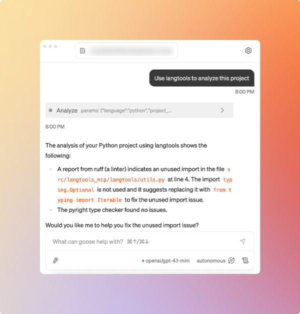

# langtools-mcp

> [!WARNING]
> 🚧 This is actively being developed, so expect issues. Currently focusing on compatibility with the on-machine AI agent [Goose](https://block.github.io/goose/docs/quickstart/). 🚧

[](https://opensource.org/licenses/MIT) [](https://www.python.org/downloads/)

**langtools-mcp** is a Model Context Protocol (MCP) server and client toolkit that gives LLMs and AI agents unified access to real static analysis tools—including batch CLI checkers (like Ruff and go vet) and LSPs (like gopls, rust-analyzer, and more).

---

## Quickstart

### Configuring for Project [Goose](https://block.github.io/goose/docs/quickstart/)

```yaml
langtools:
  args:
    - --from
    - https://github.com/flothjl/langtools-mcp
    - langtools-mcp
  bundled: null
  cmd: uvx
  description: null
  enabled: true
  env_keys: []
  envs: {}
  name: langtools-mcp
  timeout: null
  type: stdio
```

<p align="center">

</p>

### Manual

Analyze a Python or Go project:

```bash
python -m langtools_mcp path/to/your_file.py
```

Or, use the daemon in your own code:

```python
from langtools_mcp.langtools.analysis import run_analysis_for_language

result = run_analysis_for_language("python", "/path/to/my/project")
print(result)
```

---

## Why langtools-mcp?

We've all been there:

- LLM writes code that doesn't compile due to hallucinating standard libraries that don't exist, syntax errors, etc.
- LLM writes functional code, but the style, formatting, and linting is non-existent (I'm looking at you, unused imports)

**langtools-mcp** aims to help solve this by letting your AI and agentic apps **catch, explain, and even fix** issues in code, by calling the same tools expert programmers use. The goal is simply for this MCP to be a tool that the LLM begins using as part of its dev cycle. Just like IDEs and LSPs supercharged humans' ability to quickly assess and fix issues during the dev process, langtools aims to do this with an MCP tool.

- 🧠 **Supercharge Agents:** Let your LLMs/AI validate, lint, and debug their own code.
- 🧩 **Modular & Extensible:** Add new languages/tools in minutes via strategies.
- ⚡ **Daemon or Batch:** Runs as a fast HTTP daemon for LSP and batch CLI tools.

---

## Architecture

`langtools-mcp` leverages the mcp python sdk, and launches a **central daemon** (`langtools_daemon`) that manages language tools for each supported language.
Your app or agent communicates with the mcp server, and then langtools communicates with the daemon via a simple HTTP interface (local), using the provided Python client. This gives us the flexibility to add support for practically any tool

```
+----------------------------+          HTTP API        +--------------------------+
|                            | <----------------------> |                          |
|   Your App / LLM / Agent   |                          |  langtools-mcp Daemon    |
|   (Uses langtools_mcp)     |                          | (Manages code analysis)  |
+----------------------------+                          +--------------------------+
                                                                    |
                                                          +----------+----------+
                                                          |  Ruff, go vet, ...  |
                                                          |  (CLI or LSP)       |
                                                          +---------------------+
```

- **CLI tools** are executed as needed—stateless, fast.
- **LSPs** (if configured) are pooled and reused for performance.

---

## Installation

```bash
git clone https://github.com/flothjl/langtools-mcp.git
cd langtools-mcp
uv sync  # or pip install -e .[dev]
```

**Requirements:** Python 3.10+, plus [ruff](https://docs.astral.sh/ruff/), [pyright](https://github.com/microsoft/pyright), and [Go](https://go.dev/doc/install) for Go support (must be in your PATH).

---

## HTTP API Example

The daemon exposes a simple HTTP API (default: `localhost:61782`):

### Request

```json
POST /
{
  "language": "python",
  "project_root": "/absolute/path/to/project"
}
```

### Response

```json
{
  "status": "ok",
  "diagnostics": [
    {
      "source": "ruff",
      "output": [ ... ]
    },
    {
      "source": "pyright",
      "output": [ ... ]
    }
  ]
}
```

---

## Roadmap & Supported Tools

- [x] **Python**: Ruff, Pyright (CLI)
- [x] **Go**: go vet (CLI)
- [ ] **Rust**: rust-analyzer (LSP)
- [ ] **JavaScript/TypeScript**: tsc, eslint (planned)

Want to add support for your favorite tool or language?
Open a [PR](https://github.com/flothjl/langtools-mcp/pulls) or start a [Discussion](https://github.com/flothjl/langtools-mcp/discussions)!

---

## Contributing

- Fork, clone, and submit a PR!
- Code and docs welcome for new languages, better error messages, and more.
